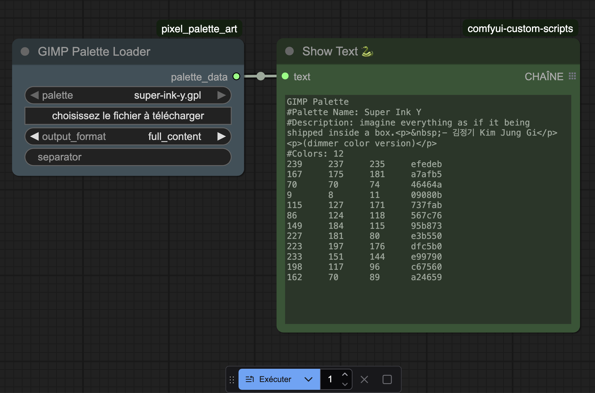
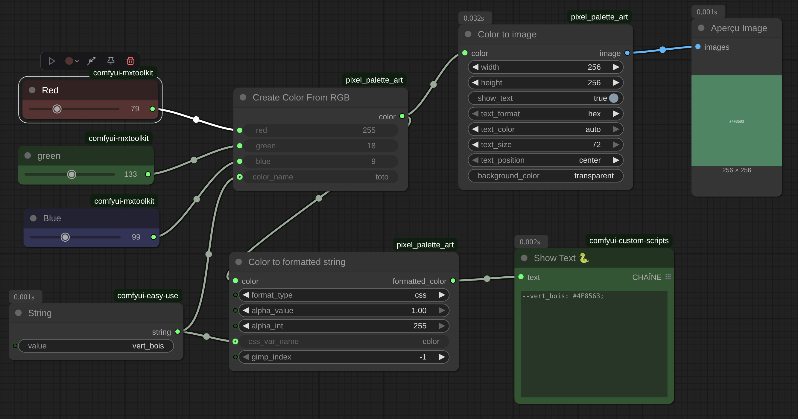
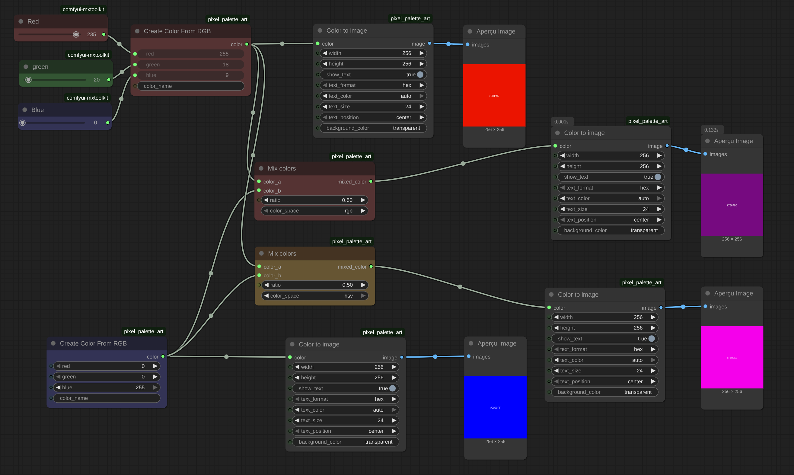

# Pixel Palette Art
Comfyui custom node: Set of tools for pixel art palette.

# Nodes

## gimp_gpl_loader

load a gpl palette file. They must be for now in the `input` folder.

You can find a lot of gpl here [lospec](https://lospec.com/)

__if you know how to upload a file please PR or open an issue__



## Color creation

You can create rgb color, and export it as text or image.



## Color mixer

The most inportant concept of this custom_nodes pack.

You can mix 2 colors and get a 3rd one.
For now there is rgb and hsv color_space mixer but I want to add more.



# Roadmap

See issue list.
The next target are export colors and palettes manipulation.

# Inspiration


https://github.com/45uee/ComfyUI-Color_Transfer

# Contribute 


first install dev dependency

```
pip install -r requirements-dev.txt
```

Then this project is very new but I want as a rubist to keep my BDD best practice.
So here I choose https://github.com/nestorsalceda/mamba who look near https://rspec.info/ .
Please if you know how to do a good BDD in python open an issue.

to run the test.
```
mamba spec/
```
Please make all test go green before asking for a PR.

## git specific

This repo use [git flow](https://danielkummer.github.io/git-flow-cheatsheet/index.fr_FR.html)
and `devlop` is set as default branch.
