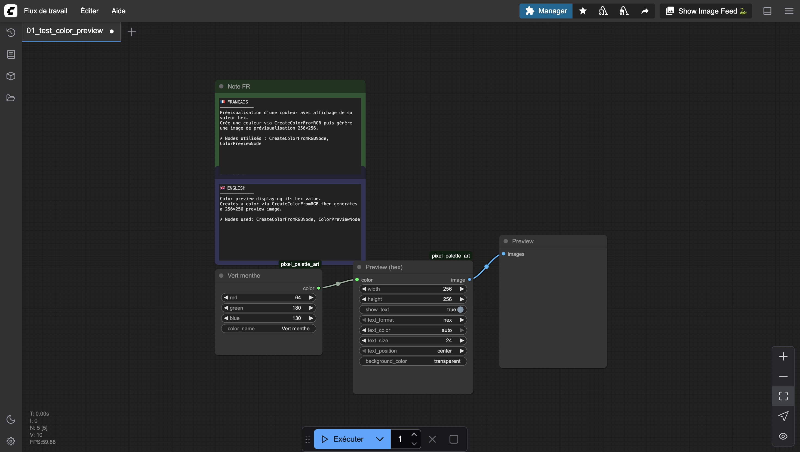
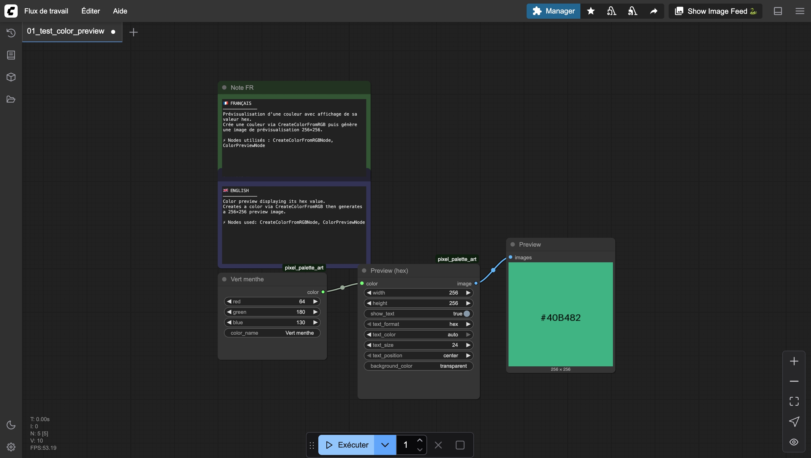

# Pixel Palette Art
Comfyui custom node: Set of tools for pixel art palette.

# Nodes

## Color Preview

Cree une image de previsualisation d'une couleur avec son code hex (ou rgb, hsl, css) en overlay.
Options : taille du texte, position, couleur auto (noir/blanc selon luminosite).





## Gimp GPL Loader

Charge un fichier palette `.gpl` (format GIMP). Les fichiers doivent etre dans le dossier `input`.

Beaucoup de palettes `.gpl` sont disponibles sur [lospec](https://lospec.com/).

__if you know how to upload a file please PR or open an issue__


## Color Creation

Cree une couleur RGB avec nom optionnel, et l'exporte en texte ou image.


## Color Mixer

Le concept central de ce pack de nodes.

Mixe 2 couleurs pour en obtenir une 3e, avec interpolation RGB ou HSV.


# Roadmap

See issue list.
The next target are export colors and palettes manipulation.

# Inspiration


https://github.com/45uee/ComfyUI-Color_Transfer

# Contribute


## Setup

```bash
pip install -r requirements-dev.txt
lefthook install
```

## Tests (BDD avec Mamba)

Ce projet utilise [mamba](https://github.com/nestorsalceda/mamba) (equivalent Python de RSpec)
avec [expects](https://expects.readthedocs.io/) pour les assertions.

```bash
# Lancer tous les tests
mamba spec/ --format=documentation

# Avec coverage
mamba spec/ --enable-coverage --format=documentation
```

Les tests sont lances automatiquement avant chaque commit via **lefthook**.
Si un test echoue, le commit est bloque.

Une CI GitHub Actions tourne aussi sur chaque push et PR (Python 3.10/3.11/3.12).

## Git

Ce repo utilise [git flow](https://danielkummer.github.io/git-flow-cheatsheet/index.fr_FR.html).
La branche par defaut est `develop`.

```bash
# Nouvelle feature
git flow feature start ma-feature

# Quand c'est pret : push et PR vers develop
git push -u origin feature/ma-feature
```

Voir `docs/pr-conventions.md` pour les conventions de messages de PR.
