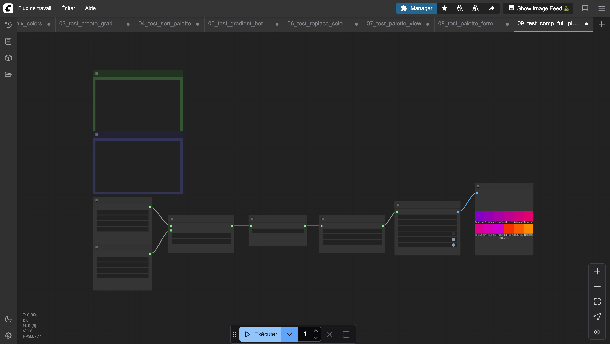

# Pixel Palette Art


A set of ComfyUI custom nodes for pixel art color and palette manipulation.

Create colors, mix them in RGB or HSV, build gradients, sort and edit palettes, then export to GIMP, hex, or any format you need.



## Installation

Clone this repository into your ComfyUI `custom_nodes` directory:

```bash
cd ComfyUI/custom_nodes
git clone https://github.com/ranska/pixel_palette_art.git
```

Restart ComfyUI. The nodes will appear under the `pixel_art` category.

## Nodes

### Colors (`pixel_art/colors`)

| Node | Description | Doc |
|------|-------------|-----|
| Create Color From RGB | Create a color from R, G, B values | [doc](docs/nodes/create_color_from_rgb.md) |
| Mix Colors | Blend two colors in RGB or HSV | [doc](docs/nodes/mix_colors.md) |

### Palette (`pixel_art/palette`)

| Node | Description | Doc |
|------|-------------|-----|
| Create Gradient Palette | Generate a gradient between two colors | [doc](docs/nodes/create_gradient_palette.md) |
| Sort Palette | Sort colors by hue or brightness | [doc](docs/nodes/sort_palette.md) |
| Gradient Between Indices | Interpolate between two palette positions | [doc](docs/nodes/gradient_between.md) |
| Replace Color At Index | Replace a single color in a palette | [doc](docs/nodes/replace_color_at.md) |
| Copy Subset | Extract a range of colors from a palette | [doc](docs/nodes/copy_subset.md) |
| Append Palette | Concatenate two palettes | [doc](docs/nodes/append_palette.md) |
| Insert Palette At Index | Insert a palette into another at a given position | [doc](docs/nodes/insert_palette_at.md) |
| Mix Palettes | Blend two palettes color by color | [doc](docs/nodes/mix_palettes.md) |

### Output (`pixel_art/output`)

| Node | Description | Doc |
|------|-------------|-----|
| Color Preview | Render a color as an image with text overlay | [doc](docs/nodes/color_preview.md) |
| Color to Formatted String | Convert a color to hex, rgb, hsl, css, etc. | [doc](docs/nodes/color_formatter.md) |
| Palette View | Render a palette as a grid or strip image | [doc](docs/nodes/palette_view.md) |
| Palette Formatter | Export a palette as formatted text | [doc](docs/nodes/palette_formatter.md) |

### IO (`pixel_art/io`)

| Node | Description | Doc |
|------|-------------|-----|
| GIMP Palette Loader | Load `.gpl`, `.pal`, or `.aco` palette files | [doc](docs/nodes/gimp_palette_loader.md) |

### Image (`image/color`)

| Node | Description | Doc |
|------|-------------|-----|
| Pixel Palette Extractor | Extract unique colors from an image | [doc](docs/nodes/pixel_palette_extractor.md) |

## Export Formats

Le node **Palette Formatter** supporte les formats d'export suivants :

| Format | Description | Exemple de sortie |
|--------|-------------|-------------------|
| `rgb` | Valeurs RGB texte | `255  0  0  Rouge` |
| `hex` | Hexadécimal | `#ff0000` |
| `gimp` | GIMP Palette `.gpl` | Header GIMP + `255  0  0  Rouge` |
| `css` | Variables CSS custom properties | `--rouge: #ff0000;` |
| `amiga` | Amiga OCS/ECS 12-bit (txt ou C) | `#F00` ou `0x0F00` |
| `raw` | Données brutes | Représentation interne |

Le système d'export est extensible via le pattern Registry. Voir `docs/architecture-registries.md`.

## Test Workflows

Example workflows are provided in [`workflows/test/`](workflows/test/). Each one demonstrates a specific node or combination of nodes, and can be loaded directly into ComfyUI.

## Contributing

### Setup

```bash
pip install -r requirements-dev.txt
lefthook install
```

### Tests (BDD with Mamba)

This project uses [mamba](https://github.com/nestorsalceda/mamba) (Python equivalent of RSpec) with [expects](https://expects.readthedocs.io/) for assertions.

```bash
# Run all tests
mamba spec/ --format=documentation

# With coverage
mamba spec/ --enable-coverage --format=documentation
```

Le seuil de coverage minimum est fixé à **90%**. La CI échoue si le coverage passe en dessous.

Tests run automatically before each commit via **lefthook**. CI runs on Python 3.10, 3.11, and 3.12 via GitHub Actions.

### Git flow

The default branch is `develop`. See [docs/pr-conventions.md](docs/pr-conventions.md) for PR guidelines.

```bash
git checkout develop && git pull
git checkout -b feature/my-feature
# work, commit, push
git push -u origin feature/my-feature
# open PR towards develop
```

## Inspiration

- [ComfyUI-Color_Transfer](https://github.com/45uee/ComfyUI-Color_Transfer)
- [Lospec](https://lospec.com/) — pixel art palette database
