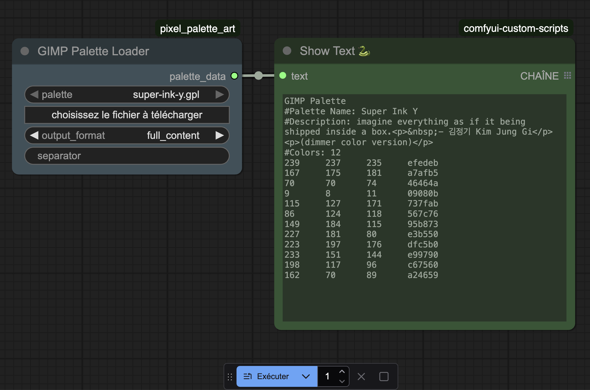
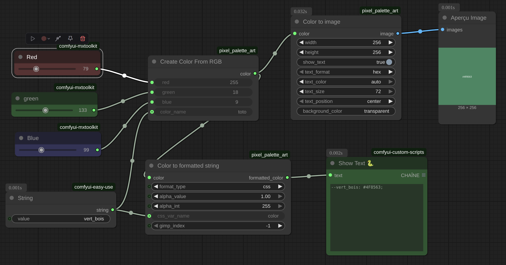
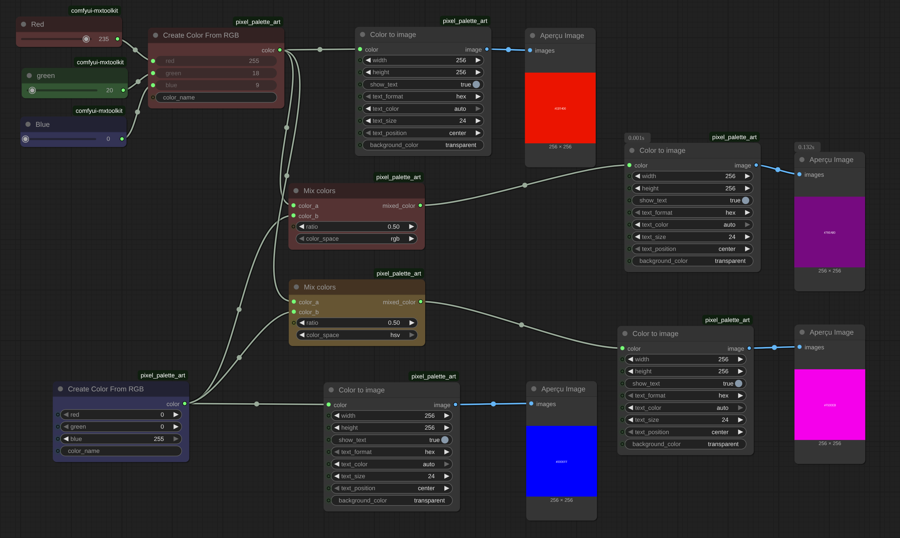

# Pixel Palette Art
Comfyui custom node: Set of tools for pixel art palette.

# Nodes

## gimp_gpl_loader

load a gpl palette file. They must be for now in the `input` folder.

You can find a lot of gpl here [lospec](https://lospec.com/)

__if you know how to upload a file please PR or open an issue__



## Color creation

You can create rgb color, and export it as text or image.



## Color mixer

The most inportant concept of this custom_nodes pack.

You can mix 2 colors and get a 3rd one.
For now there is rgb and hsv color_space mixer but I want to add more.



# Roadmap

See issue list.
The next target are export colors and palettes manipulation.

# Inspiration


https://github.com/45uee/ComfyUI-Color_Transfer

# Contribute


## Setup

```bash
pip install -r requirements-dev.txt
lefthook install
```

## Tests (BDD avec Mamba)

Ce projet utilise [mamba](https://github.com/nestorsalceda/mamba) (equivalent Python de RSpec)
avec [expects](https://expects.readthedocs.io/) pour les assertions.

```bash
# Lancer tous les tests
mamba spec/ --format=documentation

# Avec coverage
mamba spec/ --enable-coverage --format=documentation
```

Les tests sont lances automatiquement avant chaque commit via **lefthook**.
Si un test echoue, le commit est bloque.

Une CI GitHub Actions tourne aussi sur chaque push et PR (Python 3.10/3.11/3.12).

## Git

Ce repo utilise [git flow](https://danielkummer.github.io/git-flow-cheatsheet/index.fr_FR.html).
La branche par defaut est `develop`.

```bash
# Nouvelle feature
git flow feature start ma-feature

# Quand c'est pret : push et PR vers develop
git push -u origin feature/ma-feature
```

Voir `docs/pr-conventions.md` pour les conventions de messages de PR.
