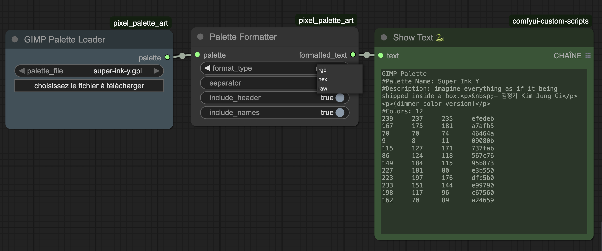

# Pixel Palette Art
Comfyui custom node: Set of tools for pixel art palette.

# Nodes

## gimp_gpl_loader

load a gpl palette file. They must be for now in the `input` folder.

You can find a lot of gpl here [lospec](https://lospec.com/)

__if you know how to upload a file please PR or open an issue__

# Inspiration

https://github.com/45uee/ComfyUI-Color_Transfer
