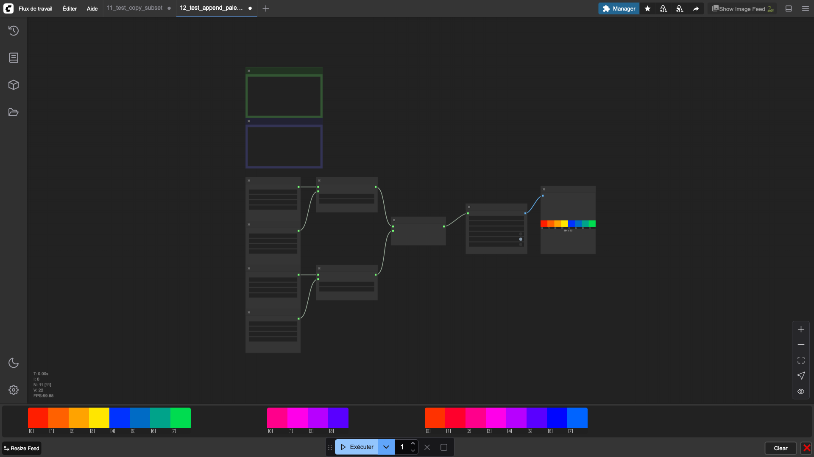

# Append Palette

Concatenates two palettes into one. All colors from palette B are appended after the colors of palette A.

## Inputs

| Name | Type | Default | Description |
|------|------|---------|-------------|
| palette_a | PIXEL_PALETTE | — | First palette |
| palette_b | PIXEL_PALETTE | — | Palette to append |

## Outputs

| Name | Type | Description |
|------|------|-------------|
| combined_palette | PIXEL_PALETTE | The merged palette |

## Category

`pixel_art/palette`
