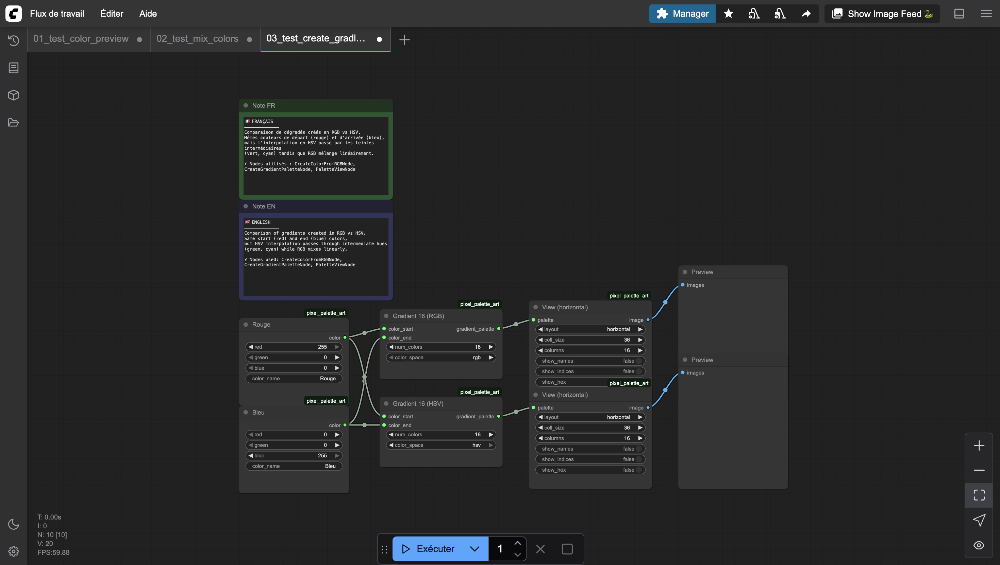
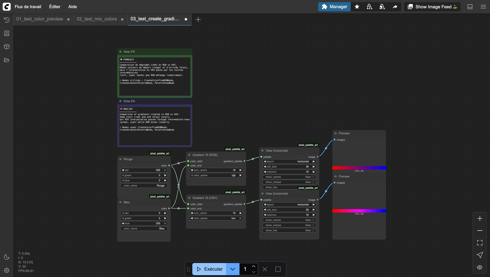

# Create Gradient Palette

Generates a palette by interpolating between two colors. The number of steps and the color space used for interpolation are configurable.

HSV interpolation produces more vibrant gradients, while RGB interpolation gives more linear transitions.

## Inputs

| Name | Type | Default | Description |
|------|------|---------|-------------|
| color_start | PIXEL_COLOR | — | Starting color |
| color_end | PIXEL_COLOR | — | Ending color |
| num_colors | INT | 8 | Number of colors in the gradient (2–256) |
| color_space | `rgb` \| `hsv` | rgb | Color space for interpolation |

## Outputs

| Name | Type | Description |
|------|------|-------------|
| gradient_palette | PIXEL_PALETTE | The generated gradient palette |

## Category

`pixel_art/palette`
