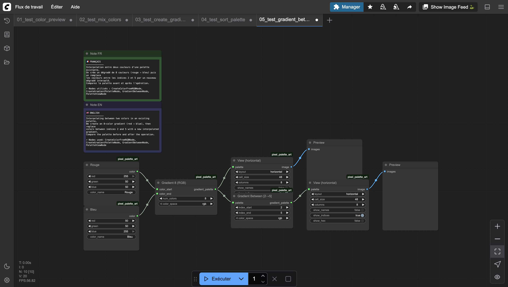
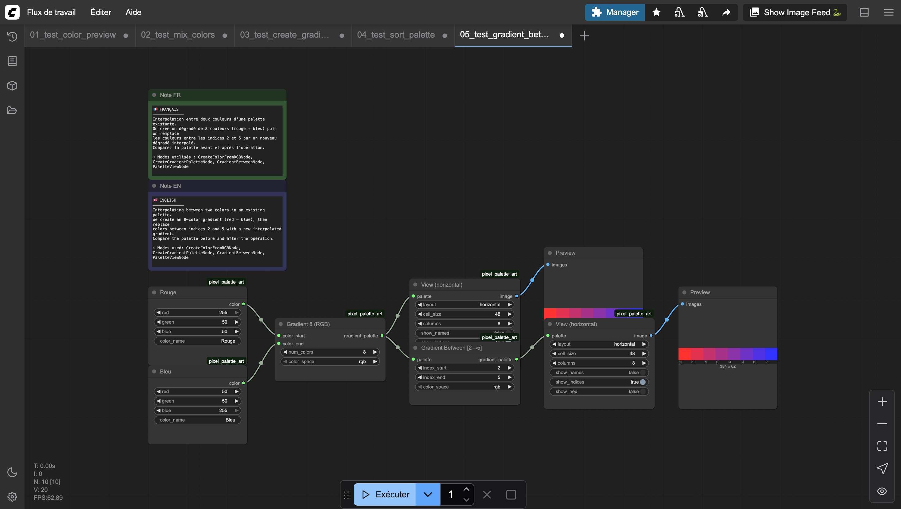

# Gradient Between Indices

Creates a smooth gradient between two colors within an existing palette, identified by their indices. All colors between the two indices are replaced by interpolated values.

## Inputs

| Name | Type | Default | Description |
|------|------|---------|-------------|
| palette | PIXEL_PALETTE | — | Source palette containing the start and end colors |
| index_start | INT | 0 | Index of the starting color (0–255) |
| index_end | INT | 2 | Index of the ending color (1–255) |
| color_space | `rgb` \| `hsv` | rgb | Color space for interpolation |

## Outputs

| Name | Type | Description |
|------|------|-------------|
| gradient_palette | PIXEL_PALETTE | Palette with the gradient applied |

## Category

`pixel_art/palette`
