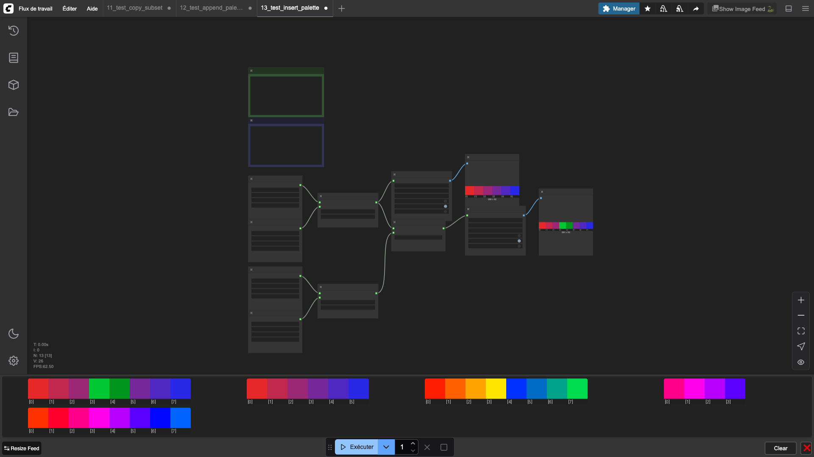

# Insert Palette At Index

Inserts all colors from a sub-palette into a destination palette at the specified index. Existing colors after the insertion point are shifted forward.

## Inputs

| Name | Type | Default | Description |
|------|------|---------|-------------|
| palette | PIXEL_PALETTE | — | Destination palette |
| sub_palette | PIXEL_PALETTE | — | Palette to insert |
| index | INT | 0 | Insertion position (0–255) |

## Outputs

| Name | Type | Description |
|------|------|-------------|
| modified_palette | PIXEL_PALETTE | Palette with inserted colors |

## Category

`pixel_art/palette`
