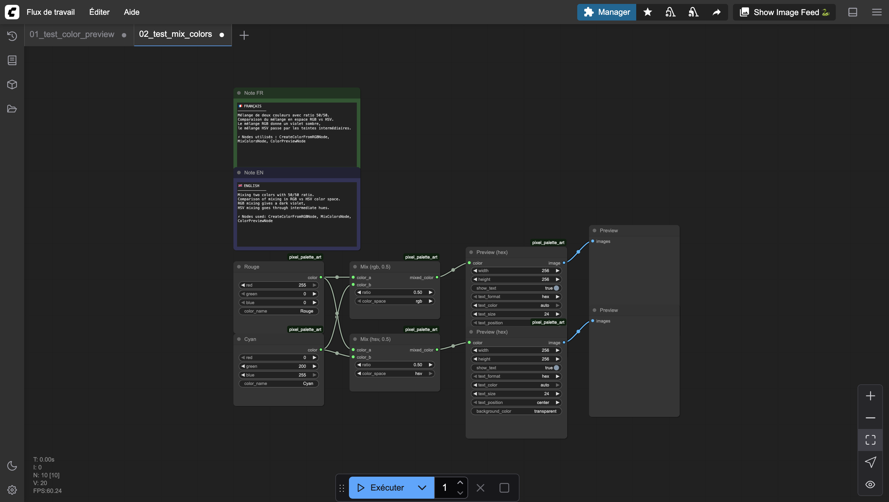
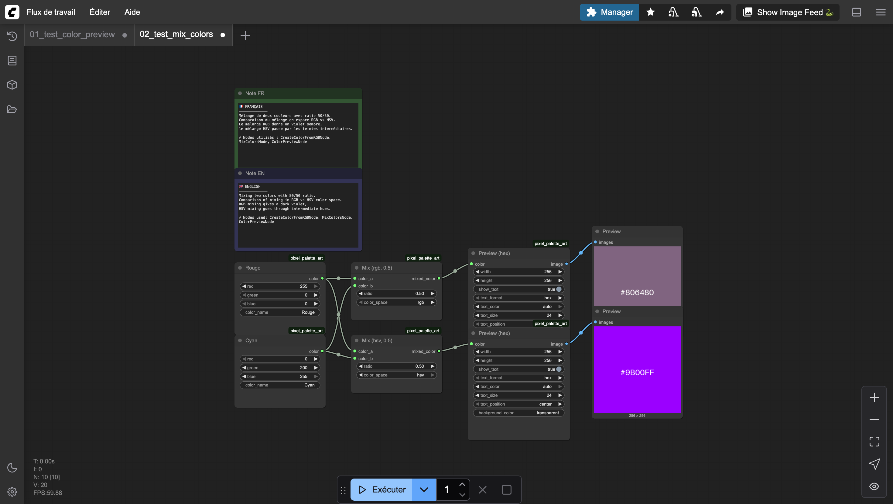

# Mix Colors

Blends two colors together using linear interpolation. Supports mixing in RGB or HSV color space for different blending results.

A ratio of 0.0 returns color A, 1.0 returns color B, and 0.5 returns an even mix.

## Inputs

| Name | Type | Default | Description |
|------|------|---------|-------------|
| color_a | PIXEL_COLOR | — | First color |
| color_b | PIXEL_COLOR | — | Second color |
| ratio | FLOAT | 0.5 | Blend ratio (0.0 = color A, 1.0 = color B) |
| color_space | `rgb` \| `hsv` | rgb | Color space for interpolation |

## Outputs

| Name | Type | Description |
|------|------|-------------|
| mixed_color | PIXEL_COLOR | The blended color |

## Category

`pixel_art/colors`
