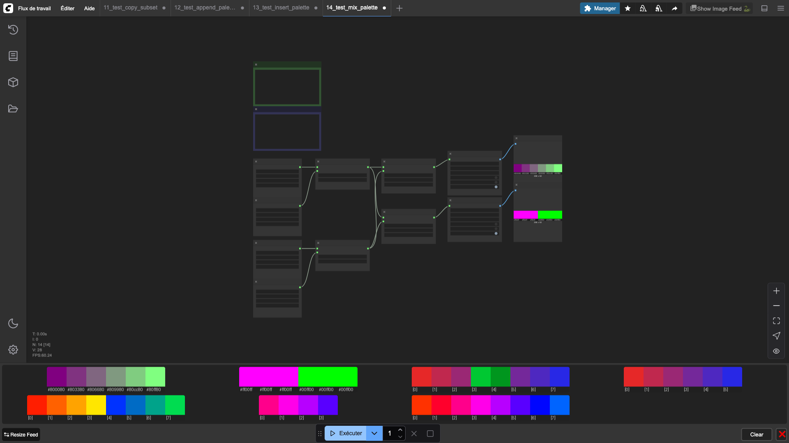

# Mix Palettes

Blends two palettes together color by color. Each color at position *i* in palette A is mixed with the color at position *i + offset* in palette B.

Supports RGB and HSV interpolation. The offset parameter allows shifting palette B before mixing.

## Inputs

| Name | Type | Default | Description |
|------|------|---------|-------------|
| palette_a | PIXEL_PALETTE | — | First palette |
| palette_b | PIXEL_PALETTE | — | Second palette |
| ratio | FLOAT | 0.5 | Blend ratio (0.0 = palette A, 1.0 = palette B) |
| color_space | `rgb` \| `hsv` | rgb | Color space for interpolation |
| offset | INT | 0 | Index offset applied to palette B (0–255) |

## Outputs

| Name | Type | Description |
|------|------|-------------|
| mixed_palette | PIXEL_PALETTE | The blended palette |

## Category

`pixel_art/palette`
