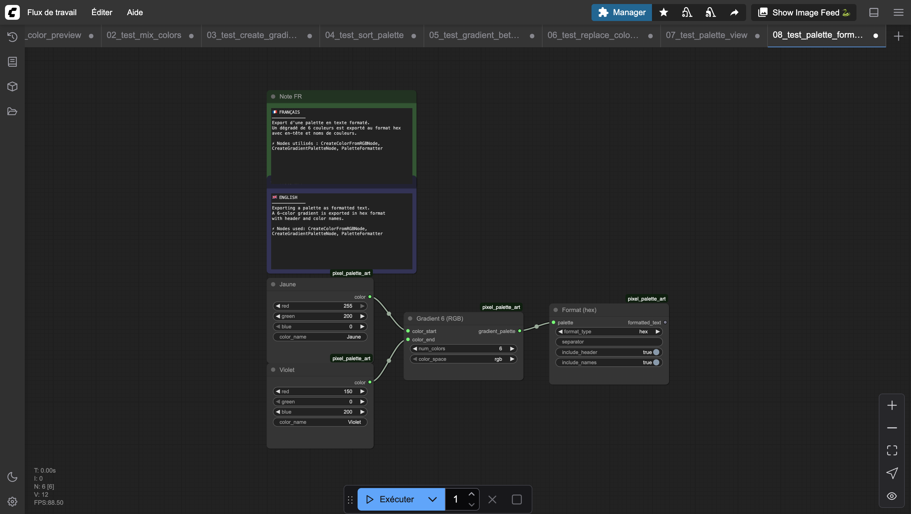

# Palette Formatter

Exports a palette as a formatted text string. Supports RGB, hex, raw tuple, and GIMP `.gpl` formats. Useful for copying palettes to external tools or saving them as text.

## Inputs

| Name | Type | Default | Description |
|------|------|---------|-------------|
| palette | PIXEL_PALETTE | — | Palette to format |
| format_type | `rgb` \| `hex` \| `raw` \| `gimp` \| `css` \| `amiga` | rgb | Output format |
| separator | STRING | `\n` | Separator between color entries |
| include_header | BOOLEAN | True | Include format header (e.g. GIMP Palette header) |
| include_names | BOOLEAN | True | Include color names in output |

## Outputs

| Name | Type | Description |
|------|------|-------------|
| formatted_text | STRING | The formatted palette text |

## Formats disponibles

| Format | Description |
|--------|-------------|
| `rgb` | Valeurs RGB : `rgb(255, 128, 0)` |
| `hex` | Hexadécimal : `#FF8000` |
| `raw` | Tuples bruts : `(255, 128, 0)` |
| `gimp` | Format GIMP `.gpl` avec header et métadonnées |
| `css` | Variables CSS : `--color-0: #FF8000;` — prêt à copier dans une feuille de style |
| `amiga` | Format Amiga OCS/ECS : valeurs RGB sur 4 bits (0-15), compatible avec les palettes rétro Amiga |

## Category

`pixel_art/output`
