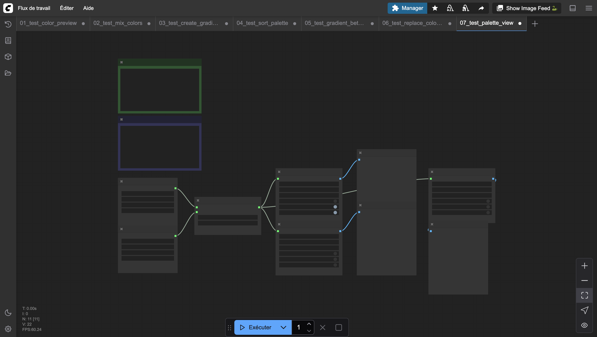
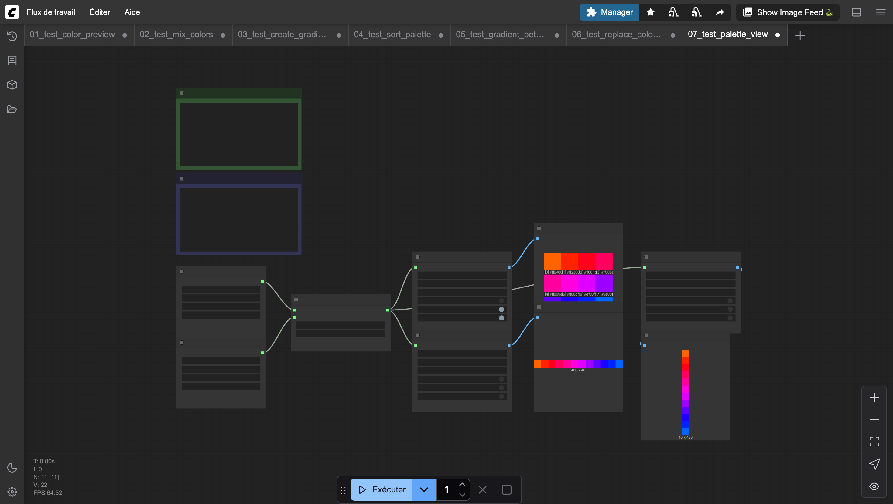

# Palette View

Renders a palette as an image with configurable layout. Colors can be displayed in a grid, a horizontal strip, or a vertical strip. Optional overlays show color names, hex values, or indices.

## Inputs

| Name | Type | Default | Description |
|------|------|---------|-------------|
| palette | PIXEL_PALETTE | — | Palette to visualize |
| layout | `grid` \| `horizontal` \| `vertical` | grid | Layout mode |
| cell_size | INT | 32 | Size of each color cell in pixels (8–128) |
| columns | INT | 8 | Number of columns in grid layout (1–64) |
| show_names | BOOLEAN | False | Show color names on each cell |
| show_indices | BOOLEAN | False | Show color indices on each cell |
| show_hex | BOOLEAN | False | Show hex values on each cell |

## Outputs

| Name | Type | Description |
|------|------|-------------|
| image | IMAGE | The rendered palette image |

## Category

`pixel_art/output`
