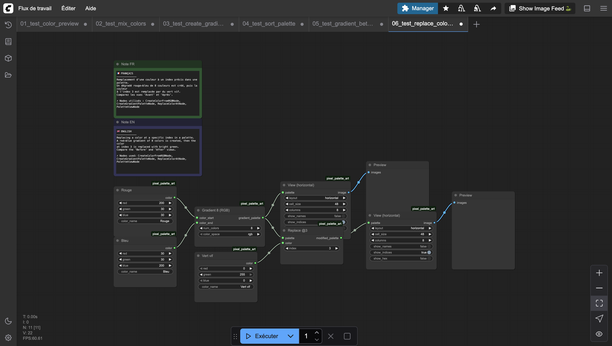
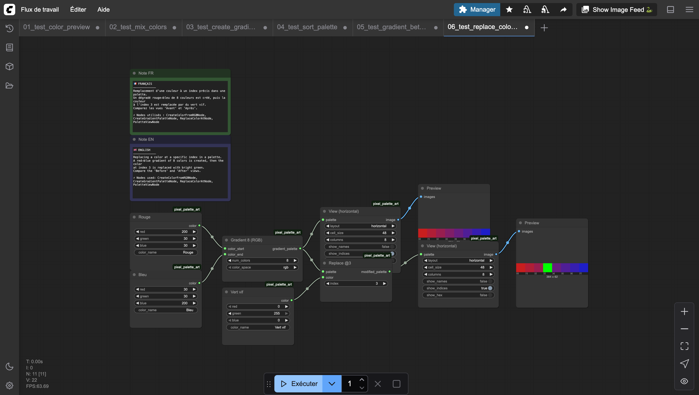

# Replace Color At Index

Replaces a single color in a palette at the specified index.

## Inputs

| Name | Type | Default | Description |
|------|------|---------|-------------|
| palette | PIXEL_PALETTE | — | Palette to modify |
| color | PIXEL_COLOR | — | New color to insert |
| index | INT | 0 | Position to replace (0–255) |

## Outputs

| Name | Type | Description |
|------|------|-------------|
| modified_palette | PIXEL_PALETTE | Palette with the replaced color |

## Category

`pixel_art/palette`
