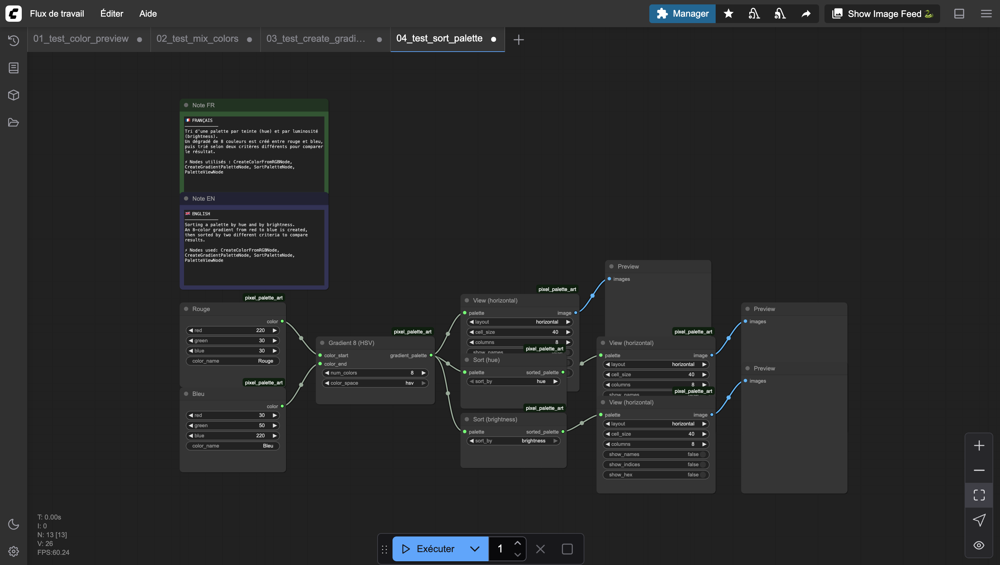
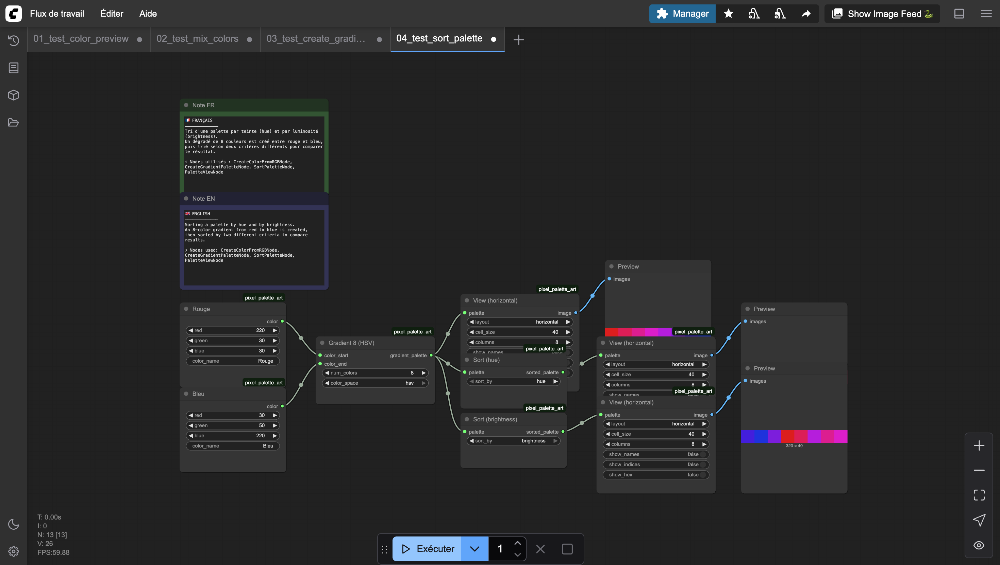

# Sort Palette

Sorts the colors of a palette by hue or brightness. Useful for organizing palettes into a visually coherent order.

## Inputs

| Name | Type | Default | Description |
|------|------|---------|-------------|
| palette | PIXEL_PALETTE | — | Palette to sort |
| sort_by | `hue` \| `brightness` | hue | Sorting criterion |

## Outputs

| Name | Type | Description |
|------|------|-------------|
| sorted_palette | PIXEL_PALETTE | The sorted palette |

## Category

`pixel_art/palette`
